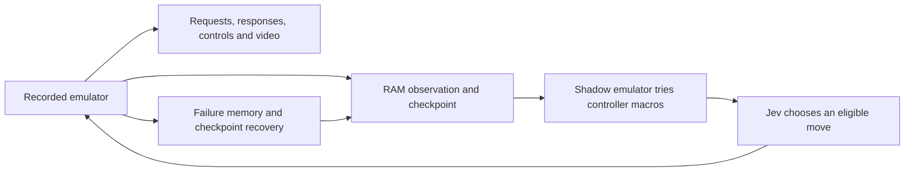

# Jev Game Agent

An experimental game-playing controller: **Jev chooses moves from RAM observations
and emulator lookahead; Python executes, records and backtracks.**

The supported adapter is **Super Mario Bros. PAL on NES**. Other games require
their own observations, actions and death/victory rules. This is experimental
software; completing a run is not guaranteed.

**Bring your own emulator and game.** This repository contains neither ROMs nor
BizHawk binaries, firmware, game assets or saved game states. It never downloads
a ROM. Asset paths can point outside the checkout.

## How it works



The game pauses while simulations and API calls run. Jev receives structured
state and predicted outcomes. The program generates candidates, filters detected
fatal outcomes and remembers failed branches. Recordings show emulator time,
not the wall-clock delay of the API or search.

## Platforms

| Host | Runtime |
| --- | --- |
| Windows x64 | Native BizHawk `EmuHawk.exe` |
| Linux x64 | Native `EmuHawkMono.sh`, Mono and a desktop display |
| macOS Intel / Apple Silicon | Linux x64 through Docker Desktop; viewer in the Mac browser |

BizHawk 2.11.1 has no current native macOS build. The Mac launcher uses a
`linux/amd64` container, including on Apple Silicon, where architecture emulation
can be slower. Python tests run on all three OSes; the container bridge is tested
on Linux x64. Apple Silicon hardware performance is not verified. See the
[upstream requirements](https://github.com/TASEmulators/BizHawk/tree/2.11.1#installing).

## Local configuration: .env

Copy `.env.example` to `.env` and fill in your own three settings:

```dotenv
TYPESAFE_API_KEY=your-key
JEV_ROM="/absolute/path/to/your/game.nes"
JEV_BIZHAWK="/absolute/path/to/BizHawk/EmuHawkMono.sh"
```

On Windows use `EmuHawk.exe`, for example
`JEV_BIZHAWK="C:/emulators/BizHawk/EmuHawk.exe"`. Spaces and literal backslashes
are supported. Relative paths resolve from the `.env` directory. The parser
does not evaluate shell commands or interpolate variables.

**`.env` is ignored by Git and Docker builds.** Only the empty `.env.example`
is published. Precedence is CLI flags, optional JSON config, existing environment,
then `.env`. Keep the complete emulator folder together, including `dll`.

## Quick start — Windows

1. Install **Python 3.11+** with the `py` launcher.
2. Download and extract **[BizHawk 2.11.1 from its official release](https://github.com/TASEmulators/BizHawk/releases/tag/2.11.1)**.
   Follow its prerequisite instructions. Keep the complete extracted folder,
   including `dll` and other dependencies; do not copy only `EmuHawk.exe`.
3. Install FFmpeg with FFprobe and the ASS subtitle filter, and put its `bin`
   directory on PATH. The [official FFmpeg download page](https://ffmpeg.org/download.html)
   links Windows builds. Verify `ffmpeg -version` and `ffprobe -version`.
4. Supply your own local **Super Mario Bros. PAL `.nes` file**. Another game or
   region is not a drop-in replacement for this adapter.
5. Get your own [TypeSafe API key](https://docs.typesafe.ai/introduction).

Clone this repository, open PowerShell in its folder, then run:

```powershell
.\start.ps1
```

The launcher creates a local virtual environment, installs Python dependencies,
loads `.env` and prompts for missing values (API input is hidden and not saved).
You can also run `py -3 start.py` if PowerShell scripts are blocked.

The launcher opens the live dashboard in your browser. If port 8768 is already
in use, run `.\start.ps1 -Port 8771` instead. After a bounded run ends, the
dashboard remains available until you close the launcher with Ctrl+C.

The first run is bounded to **10 minutes, 100 decision cycles, 100 restores and
500,000 reported input tokens**, whichever limit is reached first. These are
stop conditions, not an estimated price or a success guarantee. A request already
in progress can take usage past a threshold. Local simulation can take longer
than the model response.

## Quick start — Linux

Install Python 3.11+ with venv support, FFmpeg/FFprobe with ASS, and BizHawk's
Linux dependencies: Mono complete, OpenAL, Lua 5.4 and `lsb_release`. Download
the **Linux x64** BizHawk release, fill `.env` with its `EmuHawkMono.sh` path,
and run from a graphical desktop session:

```sh
python3 start.py
# Or: sh start.sh
```

Use the Docker option below for headless machines. A fresh native manual setup
uses `python3 -m venv .venv`, `. .venv/bin/activate`, then
`python -m pip install -r requirements.txt`. The `jev.py` commands below are
identical on Linux when using `.venv/bin/python` instead of the Windows path.

## Quick start — macOS / Docker

Install Python 3.11+ and start Docker Desktop. Download and extract the **Linux
x64** BizHawk release on your Mac; set `JEV_BIZHAWK` to its `EmuHawkMono.sh` in
`.env`, not to a Windows executable or legacy Mac build. Then run:

```sh
python3 start.py
```

macOS selects Docker automatically. `python start.py --container` enables the
same mode on Windows/Linux. The image installs Mono, FFmpeg and a virtual display;
no host X server or Mono is required. It includes neither your game nor emulator.
The game is mounted read-only; the separately mounted emulator folder must be
writable. `runs/` persists on the host. The API key is passed through the runtime
environment, never in a build argument or literal Docker command argument.

The viewer is published only on host loopback. Refresh the browser if the
container is still starting; use `--port 8771` if the default port is occupied.
Allow Docker access to your selected local folders if requested by Docker Desktop.
Use `--out my-run` to choose the new output folder `runs/my-run`.

On any platform, `python start.py --smoke` verifies the emulator, checkpoint
determinism and video recording with **zero API calls**. Use `python3` on Unix.

## Manual setup and a free local smoke test

```powershell
py -3 -m venv .venv
.\.venv\Scripts\python.exe -m pip install -r requirements.txt
Copy-Item config.example.json config.local.json
```

Edit `config.local.json` to point to your local ROM and `EmuHawk.exe`. Use forward
slashes or JSON-escaped backslashes. This file is ignored by Git. Relative paths
in the file resolve from the config file's directory. Keep the key out of it.

```powershell
.\.venv\Scripts\python.exe jev.py doctor --config config.local.json
.\.venv\Scripts\python.exe jev.py smoke --config config.local.json --out runs/smoke-01
```

`doctor` checks files and tools without launching the emulator. It recognizes
an iNES header but cannot prove that a file is the correct game or revision.
`smoke` launches a separate emulator, repeats inputs across a checkpoint restore,
compares RAM and verifies a short MP4 with audio. **It makes zero API calls.**
Its control inputs are scripted test inputs, not decisions by Jev.

For a Jev run, configure `TYPESAFE_API_KEY` in `.env` or the environment, then:

```powershell
.\.venv\Scripts\python.exe jev.py play --config config.local.json --out runs/first-play --allow-warps --wall-seconds 600 --max-decisions 100 --max-rewinds 100 --max-input-tokens 500000
```

Output directories must be new. A bounded stop normally exits with code 2;
only a verified campaign victory exits with code 0. Read `summary.json` for the
actual reason. The smoke test and unit tests have their own success status.

## Watch, stop, resume

Maze repetitions and missed maze gates are navigation feedback, **not automatic
restore triggers**. Recovery happens after actual death/game over, or after
`--stuck-frames 600` executed frames confined to a 24-pixel area (about 12 game
seconds for PAL). API/search waiting does not count. `--stuck-frames 0` disables
stationary recovery. There is no decision-count or novelty-count restart.
If the same checkpoint and identical executed inputs produce the same actual
death again, recovery moves to the parent checkpoint to escape the fatal branch;
a predicted death or maze repetition alone does not trigger this recovery.
If all initially safe options are exhausted, the search expands; if none remain,
Jev receives a clearly marked risky fallback instead of a preemptive rewind.
The game timer runs normally; a timeout death restores the level entry rather
than a checkpoint whose timer has already expired. Time/token budget stops and
technical-error recovery remain separate from gameplay failures.

For less work between moves, use `python start.py --fast` (`.\start.ps1 -Fast`
on Windows), or add `--fast` to `jev.py play`. This tries a smaller initial
candidate set and skips screenshots in the shadow emulator. It retains the same
four-frame RAM checks, predicted-death filtering, coasting horizon, recorded-player
images and full search expansion when the initial options are exhausted.
It can choose different moves and miss useful initial alternatives. It is **not
a real-time guarantee**: simulation, file I/O and API waits still pause gameplay.
Per-decision `timing.json` separates search, API and total time through execution.
The default retains the full initial search. Recordings/replay play at game speed;
that playback speed should not be described as live decision speed.

To launch play and its browser view together, add `--watch` to the play command:

```powershell
.\.venv\Scripts\python.exe jev.py play --config config.local.json --out runs/live-01 --watch --port 8771 --allow-warps --wall-seconds 600 --max-decisions 100 --max-rewinds 100 --max-input-tokens 500000
```

Use `--no-open` to print the URL without automatically opening a browser.
The dashboard shows the recorded emulator's latest confirmed screenshot, a
controller highlighting the executed buttons, the current phase (simulation,
API wait, execution or restore), exact requests/responses, RAM state, confidence,
latency, token usage and a rolling event console. Properties appear as labeled fields and expandable sections; confidence and
candidate probabilities have percentage bars. Raw JSON remains available.
This does not expose a private model reasoning trace.

**Press T to take control, then T again to return to Jev.** Use arrow keys to move,
Enter for Start, Space for Select, A for NES A (jump), and S for NES B (run/fire).
Keep the page focused. The status distinguishes a requested handoff from actual
human control. Search yields between simulation segments; a current HTTP request
may finish first (up to its 20-second request timeout). A running controller macro
finishes before handing off. Jev never executes a stale choice after a takeover.

Manual inputs drive the same recorded emulator and are labeled **Human** in the
logs and video. Returning to Jev saves the actual state and recomputes its options;
human-assisted routes are not unaided Jev runs. Losing focus releases buttons;
a missing browser heartbeat pauses manual play after 1.5 seconds. T explicitly
returns control. Open one control page per run. The viewer has a local, same-origin
JSON control endpoint; do not expose its port to the internet.

To remove the time, decision, restore and reported-token caps, explicitly use:

```sh
python start.py --until-complete
# Windows PowerShell: .\start.ps1 -UntilComplete
# Also accepted by jev.py play, including with --resume
```

This mode keeps consuming API usage until verified victory or a STOP file. It
continues retrying temporary API outages without advancing the game. Disk-space
checks, invalid credentials, replay divergence and persistent infrastructure
failures can still stop a run; unlimited attempts do not guarantee completion.
The ordinary launcher retains its 10-minute bound. Recordings continue in chapters.

This is a view of the local native emulator, not a WebAssembly emulator. Images
update at acknowledged input segments (usually four frames); the browser polls
every 120 ms and can skip intermediate snapshots. It is not a 60 FPS stream.
The game holds still during search and API waits. Audio is available in the
recorded chapters, not in the live image view. No extra emulator frames or API
calls are introduced by telemetry, although local snapshot I/O adds overhead.

The new live view requires a run created with this version. Old run folders
retain their original archived viewer. Local `live.json` and `live_events.jsonl`
are generated under the ignored run directory.

In another terminal:

```powershell
.\.venv\Scripts\python.exe jev.py watch --run runs/first-play --port 8768
```

Open the localhost URL printed by the command. It serves the selected run and
the specific inherited MP4s referenced in its video manifest;
the API key stays in the separate runner's environment. Use another port if busy.

For a graceful stop:

```powershell
New-Item -ItemType File runs/first-play/STOP
```

The current bounded operation finishes before video is finalized. To continue a
**stopped** run into a new directory, increase the cumulative limits as needed:

```powershell
.\.venv\Scripts\python.exe jev.py play --config config.local.json --out runs/continued --resume runs/first-play --allow-warps --wall-seconds 3600 --max-decisions 500 --max-rewinds 300 --max-input-tokens 2000000
```

Local runs retain complete checkpoints and may use substantial disk space.
Keep the source run accessible for inherited video links. Paths in archived run
metadata are currently local absolute paths: moving a run is not yet portable.
Do not transfer checkpoints between OSes, container/native modes or emulator
builds. Core hashes differ and must not be bypassed. Advanced container resume
and replay use the same CLI arguments with the original mounts and internal paths.

## What is recorded

- `decisions/`: exact model requests, responses, transport metadata and forecasts.
- `moves/`: executed buttons, frame counts and predicted/actual RAM fingerprints.
- `nodes/`: local emulator states and the search tree, excluded from Git.
- `events.jsonl`: restores, failures, transitions and finished video chapters.
- `progress.json`, `summary.json`, `watch.html`: status and local viewer.
- `chapters/`: MP4s with action captions, audio and checkpoint restore counts.
- `winning_route.json`: surviving route; **can still be partial** while playing.

After the final 8-4 victory condition, the runner automatically starts a replay
without API calls. Check both the campaign victory status and
`clean_replay/result.json` before claiming a complete verified replay. Manual
replay of your own local run:

```powershell
.\.venv\Scripts\python.exe jev.py replay --config config.local.json --campaign runs/first-play --out runs/replay-01
```

A replay of a partial route can pass its checks. That does not mean the game was
completed. Replaying saved controls is deterministic only with matching ROM,
emulator/core/configuration and initial state; calling Jev again may choose
different moves. Current replay requires a local initial savestate, not included
in the repository.

## Optional assistance and scope

The controller uses RAM, simulated outcomes and checkpoint recovery, so its
results measure the complete system rather than unaided model play. An optional
walkthrough guide for the 4-4 maze is disabled by default. To enable it, add:

```text
--hint-file src/jev_games/guide_4_4.json
```

It is scoped to 4-4 and logged when used. ASCII is also disabled by default;
`--ascii-level 5-3` enables the experimental screenshot-to-text observation only
on that level. Converting pixels to text does not guarantee visual understanding.

The Lua bridge can support new adapters, but the current campaign logic contains
SMB-specific assumptions. See [AGENTS.md](AGENTS.md) for the source layout and
development instructions.

## Development and publication

```powershell
.\.venv\Scripts\python.exe jev.py test
.\.venv\Scripts\python.exe tools/check_release.py
```

Tests use synthetic state and images; no ROM or API key is needed. CI also runs
the real Linux emulator against an original minimal test program generated at
runtime, with no proprietary game or API usage. That CI check downloads BizHawk
from its official release; the normal launcher does not download emulators.
The release
check inspects tracked and unignored files for forbidden assets, binaries and
likely secrets. Local generated runs stay ignored. Do not force-add them.

Keep documentation in this README and [AGENTS.md](AGENTS.md). Private notes,
post drafts, local credentials and run artifacts do not belong in the repository.

This is an independent project, not an official TypeSafe, BizHawk or Nintendo
project. The Python/Lua bridge is integration code; BizHawk itself is installed
separately. No project license has been selected. External dependencies retain
their respective licenses.
