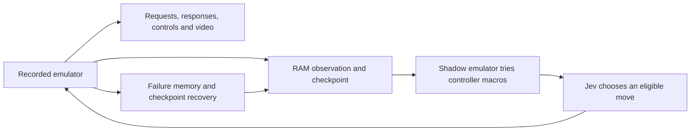

# Jev Game Agent

An experimental game-playing controller: **Jev chooses moves from RAM observations
and emulator lookahead; Python executes, records and backtracks.**

The supported adapter is **Super Mario Bros. PAL on NES**. Other games require
their own observations, actions and death/victory rules. This is experimental
software; completing a run is not guaranteed.

**Bring your own emulator and game.** This repository contains neither ROMs nor
BizHawk binaries, firmware, game assets or saved game states. It never downloads
a ROM. Asset paths can point outside the checkout.

## How it works



The game pauses while simulations and API calls run. Jev receives structured
state and predicted outcomes. The program generates candidates, filters detected
fatal outcomes and remembers failed branches. Recordings show emulator time,
not the wall-clock delay of the API or search.

## Quick start — Windows

1. Install **Python 3.11+** with the `py` launcher.
2. Download and extract **[BizHawk 2.11.1 from its official release](https://github.com/TASEmulators/BizHawk/releases/tag/2.11.1)**.
   Follow its prerequisite instructions. Keep the complete extracted folder,
   including `dll` and other dependencies; do not copy only `EmuHawk.exe`.
3. Install FFmpeg with FFprobe and the ASS subtitle filter, and put its `bin`
   directory on PATH. The [official FFmpeg download page](https://ffmpeg.org/download.html)
   links Windows builds. Verify `ffmpeg -version` and `ffprobe -version`.
4. Supply your own local **Super Mario Bros. PAL `.nes` file**. Another game or
   region is not a drop-in replacement for this adapter.
5. Get your own [TypeSafe API key](https://docs.typesafe.ai/introduction).

Clone this repository, open PowerShell in its folder, then run:

```powershell
.\start.ps1
```

The launcher creates a local virtual environment, installs Python dependencies,
asks for the two asset paths, checks prerequisites and prompts for the API key
with hidden input. It does not save the key. If your machine blocks PowerShell
scripts, use the manual Python commands below instead of changing system policy.

The launcher opens the live dashboard in your browser. If port 8768 is already
in use, run `.\start.ps1 -Port 8771` instead. After a bounded run ends, the
dashboard remains available until you close the launcher with Ctrl+C.

The first run is bounded to **10 minutes, 100 decision cycles, 100 restores and
500,000 reported input tokens**, whichever limit is reached first. These are
stop conditions, not an estimated price or a success guarantee. A request already
in progress can take usage past a threshold. Local simulation can take longer
than the model response.

## Manual setup and a free local smoke test

```powershell
py -3 -m venv .venv
.\.venv\Scripts\python.exe -m pip install -r requirements.txt
Copy-Item config.example.json config.local.json
```

Edit `config.local.json` to point to your local ROM and `EmuHawk.exe`. Use forward
slashes or JSON-escaped backslashes. This file is ignored by Git. Relative paths
in the file resolve from the config file's directory. Keep the key out of it.

```powershell
.\.venv\Scripts\python.exe jev.py doctor --config config.local.json
.\.venv\Scripts\python.exe jev.py smoke --config config.local.json --out runs/smoke-01
```

`doctor` checks files and tools without launching the emulator. It recognizes
an iNES header but cannot prove that a file is the correct game or revision.
`smoke` launches a separate emulator, repeats inputs across a checkpoint restore,
compares RAM and verifies a short MP4 with audio. **It makes zero API calls.**
Its control inputs are scripted test inputs, not decisions by Jev.

For a Jev run, set `TYPESAFE_API_KEY` in the process environment (the interactive
launcher does this without echoing the key), then:

```powershell
.\.venv\Scripts\python.exe jev.py play --config config.local.json --out runs/first-play --allow-warps --wall-seconds 600 --max-decisions 100 --max-rewinds 100 --max-input-tokens 500000
```

Output directories must be new. A bounded stop normally exits with code 2;
only a verified campaign victory exits with code 0. Read `summary.json` for the
actual reason. The smoke test and unit tests have their own success status.

## Watch, stop, resume

To launch play and its browser view together, add `--watch` to the play command:

```powershell
.\.venv\Scripts\python.exe jev.py play --config config.local.json --out runs/live-01 --watch --port 8771 --allow-warps --wall-seconds 600 --max-decisions 100 --max-rewinds 100 --max-input-tokens 500000
```

Use `--no-open` to print the URL without automatically opening a browser.
The dashboard shows the recorded emulator's latest confirmed screenshot, a
controller highlighting the executed buttons, the current phase (simulation,
API wait, execution or restore), exact requests/responses, RAM state, confidence,
latency, token usage and a rolling event console. It does not send controller
input from the browser or reveal a private model reasoning trace.

This is a view of the local native emulator, not a WebAssembly emulator. Images
update at acknowledged input segments (usually four frames); the browser polls
every 120 ms and can skip intermediate snapshots. It is not a 60 FPS stream.
The game holds still during search and API waits. Audio is available in the
recorded chapters, not in the live image view. No extra emulator frames or API
calls are introduced by telemetry, although local snapshot I/O adds overhead.

The new live view requires a run created with this version. Old run folders
retain their original archived viewer. Local `live.json` and `live_events.jsonl`
are generated under the ignored run directory.

In another terminal:

```powershell
.\.venv\Scripts\python.exe jev.py watch --run runs/first-play --port 8768
```

Open the localhost URL printed by the command. It serves the selected run and
the specific inherited MP4s referenced in its video manifest;
the API key stays in the separate runner's environment. Use another port if busy.

For a graceful stop:

```powershell
New-Item -ItemType File runs/first-play/STOP
```

The current bounded operation finishes before video is finalized. To continue a
**stopped** run into a new directory, increase the cumulative limits as needed:

```powershell
.\.venv\Scripts\python.exe jev.py play --config config.local.json --out runs/continued --resume runs/first-play --allow-warps --wall-seconds 3600 --max-decisions 500 --max-rewinds 300 --max-input-tokens 2000000
```

Local runs retain complete checkpoints and may use substantial disk space.
Keep the source run accessible for inherited video links. Paths in archived run
metadata are currently local absolute paths: moving a run is not yet portable.

## What is recorded

- `decisions/`: exact model requests, responses, transport metadata and forecasts.
- `moves/`: executed buttons, frame counts and predicted/actual RAM fingerprints.
- `nodes/`: local emulator states and the search tree, excluded from Git.
- `events.jsonl`: restores, failures, transitions and finished video chapters.
- `progress.json`, `summary.json`, `watch.html`: status and local viewer.
- `chapters/`: MP4s with action captions, audio and checkpoint restore counts.
- `winning_route.json`: surviving route; **can still be partial** while playing.

After the final 8-4 victory condition, the runner automatically starts a replay
without API calls. Check both the campaign victory status and
`clean_replay/result.json` before claiming a complete verified replay. Manual
replay of your own local run:

```powershell
.\.venv\Scripts\python.exe jev.py replay --config config.local.json --campaign runs/first-play --out runs/replay-01
```

A replay of a partial route can pass its checks. That does not mean the game was
completed. Replaying saved controls is deterministic only with matching ROM,
emulator/core/configuration and initial state; calling Jev again may choose
different moves. Current replay requires a local initial savestate, not included
in the repository.

## Optional assistance and scope

The controller uses RAM, simulated outcomes and checkpoint recovery, so its
results measure the complete system rather than unaided model play. An optional
walkthrough guide for the 4-4 maze is disabled by default. To enable it, add:

```text
--hint-file src/jev_games/guide_4_4.json
```

It is scoped to 4-4 and logged when used. ASCII is also disabled by default;
`--ascii-level 5-3` enables the experimental screenshot-to-text observation only
on that level. Converting pixels to text does not guarantee visual understanding.

The Lua bridge can support new adapters, but the current campaign logic contains
SMB-specific assumptions. See [AGENTS.md](AGENTS.md) for the source layout and
development instructions.

## Development and publication

```powershell
.\.venv\Scripts\python.exe jev.py test
.\.venv\Scripts\python.exe tools/check_release.py
```

Tests use synthetic state and images; no ROM or API key is needed. The release
check inspects tracked and unignored files for forbidden assets, binaries and
likely secrets. Local generated runs stay ignored. Do not force-add them.

Keep documentation in this README and [AGENTS.md](AGENTS.md). Private notes,
post drafts, local credentials and run artifacts do not belong in the repository.

This is an independent project, not an official TypeSafe, BizHawk or Nintendo
project. The Python/Lua bridge is integration code; BizHawk itself is installed
separately. No project license has been selected. External dependencies retain
their respective licenses.
